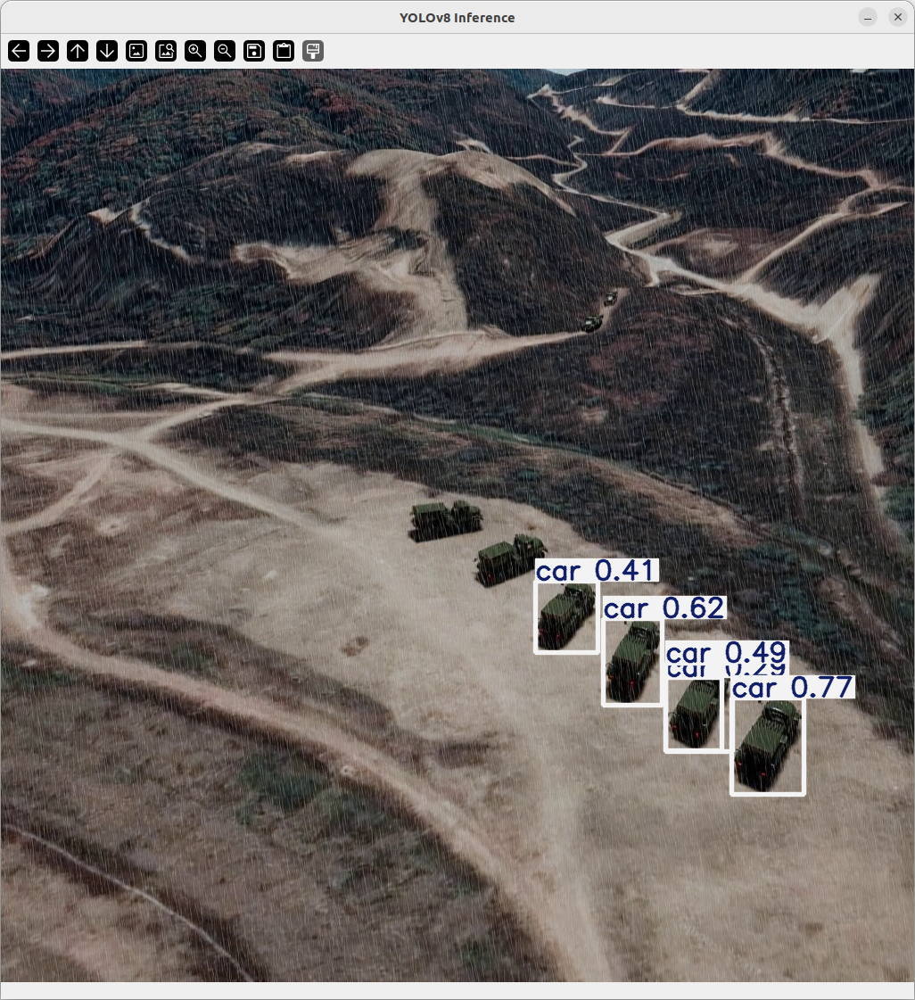
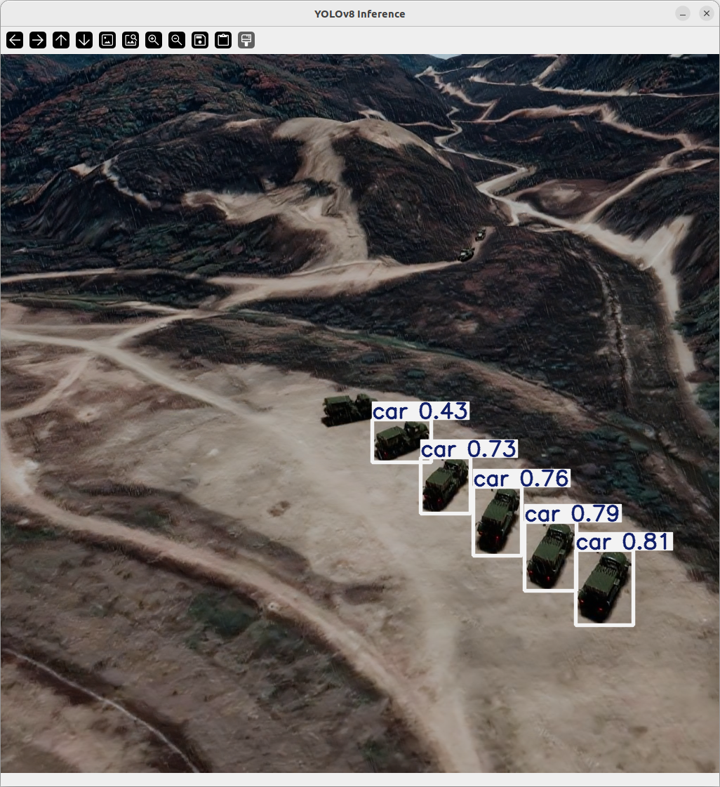

# YOLO + Derain 테스트 프로젝트

이 프로젝트는 영상 처리 파이프라인(검출, 트래킹 등)에 TensorRT 기반 derain(비 제거) 전처리를 쉽게 붙이기 위한 유틸 모음입니다.

## 주요 구성
- `derain_tool.py`: TensorRT derain 추론 로직
- `config/derain.py`: derain 설정 (엔진 경로 등)
- `model/`: 모델 파일 저장 위치
- `input/`: 입력 영상/이미지
- `figures/`: 결과 예시 이미지

## 실행 환경
- Python 3.10 
- NVIDIA GPU
- CUDA 12.4
- TensorRT 10.1.0

## 설치
```bash
pip install -r requirements.txt
```
TensorRT는 일반 pip 환경에서 설치되지 않을 수 있으므로, NVIDIA 가이드에 따라 별도 설치가 필요합니다.

### TensorRT 설치 참고
- https://docs.nvidia.com/deeplearning/tensorrt/latest/installing-tensorrt/installing.html#method-2-debian-package-installation
- https://developer.nvidia.com/tensorrt/download/10x


## 설정
- `config/cfg.py`의 `DERAIN_ENGINE`에 ONNX로부터 변환한 TensorRT 엔진 경로를 지정합니다.
- `config/cfg.py`의 `DERAIN_ROI_SIZE`에 정사각형 모양 ROI의 한 변의 길이를 지정합니다.

## 사용 방법 (검출/트래킹 파이프라인에 연결)
아래처럼 리스트, 단일 프레임 또는 여러 프레임의 묶음을 `np.ndarray` 형태(HWC, NHW3)로 `deraining()`에 전달하면 됩니다.

```python
import numpy as np
from derain_tool import deraining

frame = ...  # list, np.ndarray { shape (H, W, 3) or (N, H, W, 3) }
frame = deraining(frame)
```

### 설정 파일
`config/derain.py`에서 엔진 경로를 고정합니다.
```python
DERAIN_ENGINE = "./model/derain/derain.engine"
DERAIN_ROI_SIZE = 1024
```

## 참고
-  입력 영상이 1024x1024라는 가정 하에 엔진의 최적 shape를 1024x1024로 설정하여 단일 프레임 전체를 처리하도록 했습니다. 
-  다중 배치 처리를 위해서는 TensorRT 엔진 변환 시 배치를 1보다 크게 설정해두어야 합니다.
-  ROI 는 입력영상의 중심을 기준으로 합니다.
-  사용할 Shape과 Batch를 고려하여 배포하세요.

## YOLO Detect 테스트 이미지
Derain 적용 전/후 YOLO Detect 결과 비교입니다.

| Derain 적용 전 | Derain 적용 후 |
| --- | --- |
|  |  |
